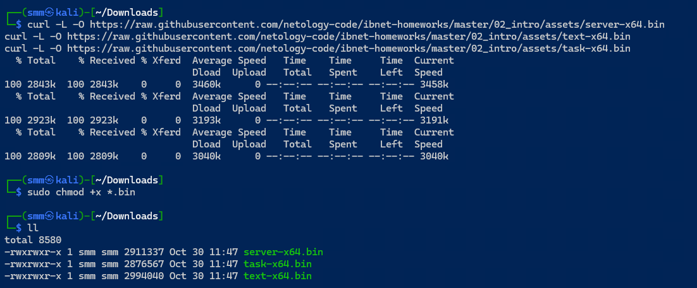
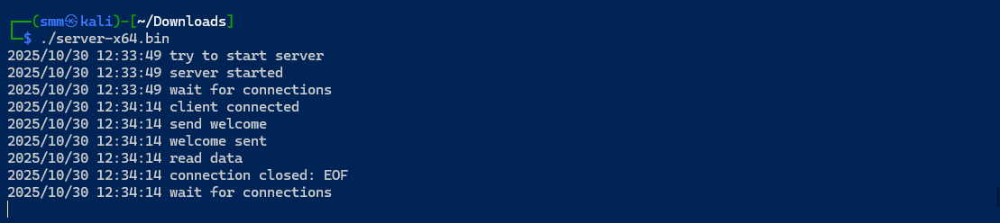
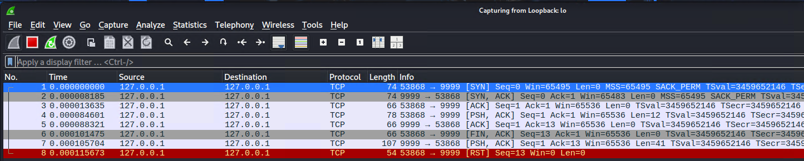
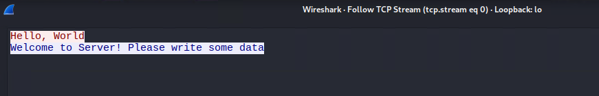
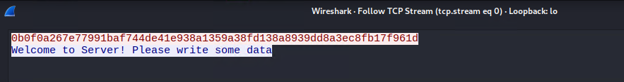
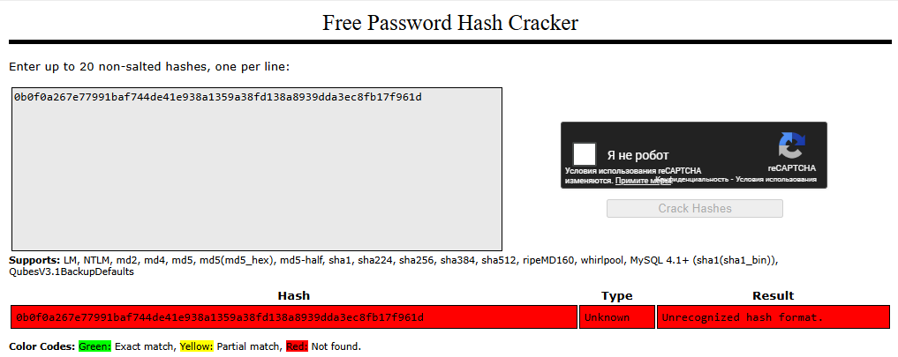
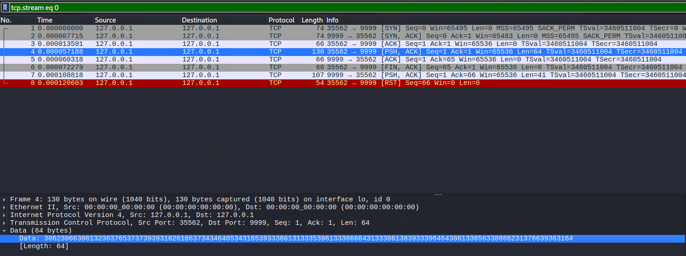
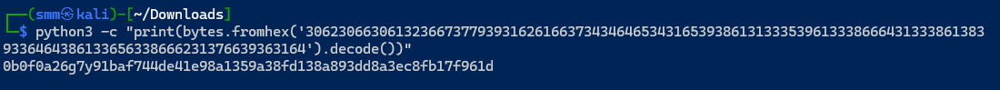
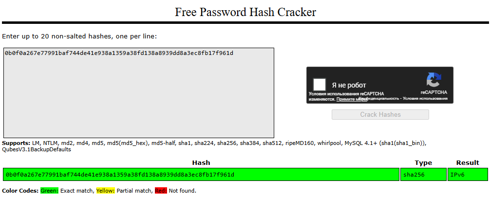
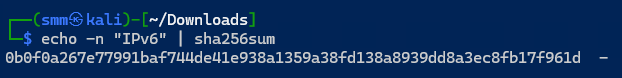

# Домашнее задание к занятию «Сетевые технологии, ключевые устройства»

## Задача «Знакомство с Wireshark»

Предварительные действия.

Используйте виртуальную машину с Kali Linux и указанные в предыдущем разделе файлы. Если машина с Kali Linux у вас не запускается, вам придётся самостоятельно установить [Wireshark с официального сайта](https://www.wireshark.org/download.html) и использовать соответствующие исполняемые файлы из каталога [assets](assets).

#### Выполнение

1\. Откройте виртуальную машину, в поисковой строке введите `wireshark`:

2\. Вас попросят ввести пароль вашего пользователя для подтверждения (`kali`, если вы скачивали OVA с официального сайта):

3\. В запустившемся окне вам необходимо выбрать интерфейс `Loopback: lo`

4\. Сохраните файлы в каком-либо каталоге (например, в `Downloads`):
1. [server-x64.bin](https://raw.github.com/netology-code/ibnet-homeworks/tree/master/02_intro/assets/server-x64.bin)
1. [text-x64.bin](https://raw.github.com/netology-code/ibnet-homeworks/tree/master/02_intro/assets/text-x64.bin)
1. [task-x64.bin](https://raw.github.com/netology-code/ibnet-homeworks/tree/master/02_intro/assets/task-x64.bin)

4\. Откройте терминал в данном каталоге (см. [руководство по терминалу](../terminal), открывается аналогично Ubuntu):

5\. Выполните в первой вкладке следующую команду (выставление прав на запуск приложений): `chmod +x *.bin`

6\. Запустите в первой вкладке сервер командой: `./server-x64.bin`

7\. Запустите во второй вкладке тестовый клиент для отправки сообщения: `./text-x64.bin "Hello, World"` (сервер должен продолжать работать)

8\. В окне Wireshark вы должны увидеть следующее:

9\. Щёлкните правой кнопкой мыши на первой строке и выберите опции как на скриншоте:

10\. Вы увидите взаимодействие между клиентом и сервером в текстовом виде в кодировке ASCII:

11\. Запустите целевой клиент во второй вкладке: `./task-x64.bin`

Попробуйте проанализировать сетевое взаимодействие целевого клиента с сервером. В качестве сообщения клиент должен передать хэш SHA-256. Воспользуйтесь в этот раз не hashcat, а предвычисленными таблицами для хэшей, например [crackstation.net](https://crackstation.net) для подбора захэшированного сообщения. Если  не получится через [crackstation.net](https://crackstation.net), то поробуйте через [hashes.com](https://hashes.com/)

## Решение

Детали пеерхвата текстового сообщения.

1\. Подготовка файлов.

2\. Запуск сервера 

3\. Запрос к серверу

4\. Список пакетов в Wireshark 

5\. Перехваченное текстовое сообщение

6\. Результат перехвата сообщения от task-x64.bin

Проблема в том, что SHA-256 должен быть 64 hex, а я получил 63 символа.

ВОзможно выьащить хэш в формате ASCII

Декодируем в текст

CrackStation подтверждает тип хэширования SHA-256. Захэшированное слово "IPv6"

Проверка. Хэш получился тот же.

